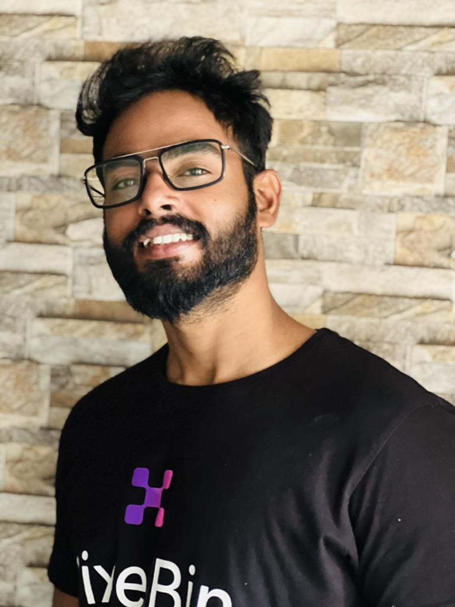

   
    <a href="https://amitkumar-das.com" target="_blank">
      
      <h3 style="display:inline-block; vertical-align:middle; margin-left: 10px; line-height: 100px;">A Modern Portfolio by Amit Kumar Das</h3>
    </a>
   

   

     This portfolio showcases my journey, skills, and experiences in the tech industry. 
    

## 📋 <a name="table">Table of Contents</a>

1. 🤖 [Introduction](#introduction)
2. 🛤️ [Journey Timeline](#journey-timeline)
3. 🚀 [Contact](#contact)

## 🚨 Introduction

I am an engineering post-graduate with a deep passion for technology and software development, committed to building high-impact, scalable solutions. My career has focused on optimizing engineering productivity, ensuring system reliability, and streamlining release engineering processes.

As the Co-founder and Head of Engineering at Ratl.ai, I am spearheading the future of AI-driven software testing and automation.

## <a name="journey-timeline">🛤️ Journey Timeline</a>

### Cofounder and Head of Engineering at Ratl.ai

_January 2024 - Present_

- Focus on integrating intelligent automation, comprehensive testing, and continuous monitoring to ensure software reliability and efficiency.

### Engineering Lead at Fynd

_January 2024 - Present_

- Leading engineering productivity and reliability for e-commerce sales channels, architecting and building AI-powered solutions.

### Software Engineer at Microsoft

_June 2021 - January 2022_

- Developed a direct-to-consumer platform, ensuring high-quality application performance through automation and testing frameworks.

### Software Development Engineer at Jio

_February 2021 - June 2021_

- Key role in developing automation frameworks for the JioMart e-commerce application.

### Senior Software Engineer at SAS

_May 2019 - February 2021_

- Responsible for testing and maintaining CI/CD processes, managing UI automation teams, and ensuring comprehensive testing approaches.

### Software Engineer at Infosys

_May 2017 - May 2019_

- Received professional training in fundamental technologies and developed automation frameworks.

## <a name="contact">🚀 Contact</a>

Feel free to connect with me on social media:

- [GitHub](https://github.com/amitkiit1994)
- [Twitter](https://twitter.com/AmitKdas94)
- [LinkedIn](https://linkedin.com/in/amitkiit1994)
- [Instagram](https://instagram.com/amitkumardas___)
- [WhatsApp](https://wa.me/918093151099)
